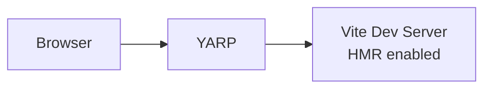
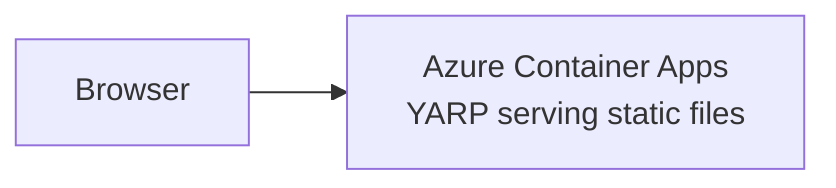

# Vite + YARP Static Files Sample

YARP reverse proxy serving a Vite frontend, deployed to Azure Container Apps using Pulumi.

## Architecture

**Run Mode (Local Development):**


**Publish Mode (Cloud Deployment):**


## What This Demonstrates

- **AddViteApp**: Vite-based frontend application
- **AddYarp**: Reverse proxy with dual-mode routing
- **AddPulumiAzureEnvironment**: Azure Container Apps deployment via Pulumi
- **PublishWithStaticFiles**: Automatic static file serving in production
- **Dual Execution Modes**: Both `aspire deploy` and `pulumi up` work

## Prerequisites

1. **Build the Language Host** (required for `pulumi up`):
   ```bash
   cd pulumi-language-aspire
   go build -o pulumi-language-aspire.exe .
   ```

2. **Azure CLI** - Logged in with `az login`
3. **Pulumi CLI** - Logged in with `pulumi login`

## Running Locally

```bash
aspire run
```

## Deploying to Azure

### Option 1: Automation API Mode (`aspire deploy`)

Best for CI/CD and programmatic control. No additional PATH setup required.

```bash
aspire deploy
```

### Option 2: Engine Mode (`pulumi up`)

Best for interactive development and Pulumi ecosystem integration. Requires the language host in PATH.

```powershell
# PowerShell - Add language host to PATH (from repo root)
$env:PATH = ".\pulumi-language-aspire;$env:PATH"

# Deploy
pulumi up

# Preview changes
pulumi preview

# View outputs (URLs, resource names)
pulumi stack output

# Destroy resources
pulumi destroy
```

```bash
# Bash/Linux - Add language host to PATH (from repo root)
export PATH="./pulumi-language-aspire:$PATH"

# Deploy
pulumi up
```

## Commands Summary

| Command | Mode | Description |
|---------|------|-------------|
| `aspire run` | Local | Run with Vite HMR |
| `aspire deploy` | Automation API | Deploy to Azure |
| `pulumi up` | Engine | Deploy via Pulumi CLI |
| `pulumi preview` | Engine | Preview changes |
| `pulumi destroy` | Engine | Tear down resources |
| `aspire do pulumi-destroy-dev` | Automation API | Destroy via Aspire |

## Key Aspire Patterns

**Dual-Mode YARP** - Run mode proxies to Vite, publish mode serves static files:
```csharp
var frontend = builder.AddViteApp("frontend", "./frontend");

builder.AddYarp("app")
    .WithConfiguration(c =>
    {
        if (builder.ExecutionContext.IsRunMode)
            c.AddRoute("{**catch-all}", frontend); // Run: proxy to Vite HMR
    })
    .PublishWithStaticFiles(frontend); // Publish: serve static files
```

**Pulumi Azure Environment** - Deploys to Azure Container Apps:
```csharp
builder.AddPulumiAzureEnvironment("dev", "vite-yarp-static")
    .WithLocation("eastus");
```

## Sample Outputs

After deployment, you'll see outputs like:
```
app-fqdn                    : "app--xxxxx.eastus.azurecontainerapps.io"
containerRegistryLoginServer: "acrxxxxx.azurecr.io"
managedEnvironmentName      : "vite-yarp-static-dev-env"
resourceGroupName           : "vite-yarp-static-dev-rg"
```
