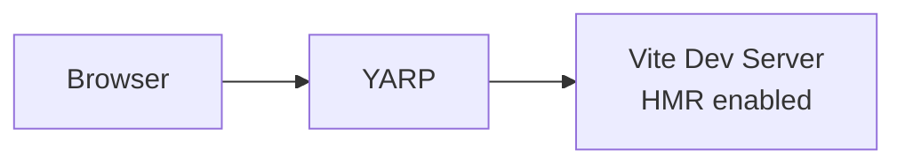
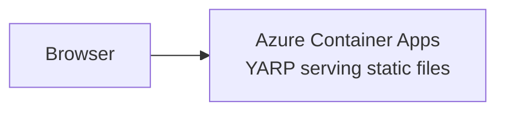

# Vite + YARP Static Files Sample

YARP reverse proxy serving a Vite frontend, deployed to Azure Container Apps using Pulumi.

## Architecture

**Run Mode (Local Development):**

```mermaid
flowchart LR
    Browser --> YARP
    YARP --> Vite[Vite Dev Server<br/>HMR enabled]
```

**Publish Mode (Cloud Deployment):**

```mermaid
flowchart LR
    Browser --> ACA[Azure Container Apps<br/>YARP serving static files]
```

## What This Demonstrates

- **AddViteApp**: Vite-based frontend application
- **AddYarp**: Reverse proxy with dual-mode routing
- **PublishAsPulumi**: Azure Container Apps environment deployed via Pulumi
- **PublishWithStaticFiles**: Automatic static file serving in production

## Prerequisites

1. **Azure CLI** - Logged in with `az login`
2. **Pulumi CLI** - Logged in with `pulumi login`

## Running Locally

```bash
aspire run
```

## Deploying to Azure

```bash
aspire deploy
```

## Commands Summary

| Command | Description |
|---------|-------------|
| `aspire run` | Run locally with Vite HMR |
| `aspire publish` | Write a reviewable `pulumi preview` artifact |
| `aspire deploy` | Deploy to Azure via Pulumi Automation API |
| `aspire destroy` | Tear down resources |

## Key Aspire Patterns

**Dual-Mode YARP** - Run mode proxies to Vite, publish mode serves static files:
```csharp
var frontend = builder.AddViteApp("frontend", "./frontend");

builder.AddYarp("app")
    .WithConfiguration(c =>
    {
        if (builder.ExecutionContext.IsRunMode)
            c.AddRoute("{**catch-all}", frontend); // Run: proxy to Vite HMR
    })
    .PublishWithStaticFiles(frontend); // Publish: serve static files
```

**Pulumi-Managed Azure Container Apps Environment** - Aspire models the environment, Pulumi deploys it —
one line; the suppression selector, translation program, and registry-first phase are inferred:
```csharp
builder.AddAzureContainerAppEnvironment("vite-yarp-static")
    .PublishAsPulumi(new AzureAdoptionOptions { Location = "eastus" });
```

## Sample Outputs

After deployment, you'll see outputs like:
```
app-fqdn                    : "app--xxxxx.eastus.azurecontainerapps.io"
containerRegistryLoginServer: "acrxxxxx.azurecr.io"
managedEnvironmentName      : "vite-yarp-static-dev-env"
resourceGroupName           : "vite-yarp-static-dev-rg"
```
